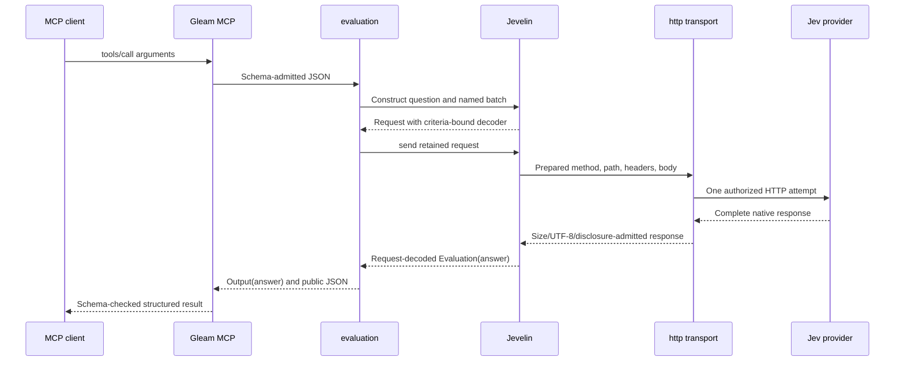

# Architecture and reading path

Jevelin MCP turns four MCP tool shapes into Jevelin requests, then returns
answers decoded against the original criteria. The application owns operator
configuration and upstream HTTP. The Jevelin dependency owns question
construction and answer validation. Gleam MCP owns discovery, protocol
admission, typed codecs, and transport request lifetime.

Read [the executable](../src/jevelin_mcp.gleam) first, then
[service](../src/jevelin_mcp/service.gleam) for MCP admission and
[HTTP](../src/jevelin_mcp/http.gleam) for upstream authority. Follow
[tool](../src/jevelin_mcp/tool.gleam) into
[evaluation](../src/jevelin_mcp/evaluation.gleam) for the argument-to-answer
contract. Each module's `## Flow` names the actual functions in that path.
[Principles](principles.md) explains why those boundaries exist; the
[style guide](gleam-style.md) supplies the Gleam language tour and conventions.

## Ownership

| Module or dependency | Owns | Contract passed onward |
| --- | --- | --- |
| `jevelin_mcp` | Startup order and foreground service lifetime. | Registered server and selected runner. |
| `service` | MCP transport settings and independent caller credential. | `Mode`, with validated SDK HTTP configuration. |
| `http` | Jev key, permitted authority, native HTTP timeout and safe response admission. | One-attempt `evaluation.Transport` closure. |
| `tool` | Shared schemas, typed codecs, and transport binding. | Typed definitions for clients; bound registry entries for servers. |
| `evaluation` | Wire admission, criteria preparation, safe error mapping and output projection. | Opaque `Arguments(answer)` and `Output(answer)`. |
| Jevelin | Opaque question/request constructors and request-bound answer decoders. | `Request(Evaluation(answer))`, then decoded domain values. |
| Gleam MCP | MCP parsing, schema checking, request dispatch, scopes and protocol output. | Admitted tool callbacks and structured results. |

`evaluation` and `tool` import no runtime effects. A function-valued transport
is injected into them, and only `evaluation.execute` invokes it. Constructing
schemas or arguments cannot read a credential or open a connection. The
existing [source gate](../scripts/check_source.py) checks those imports and
custom FFI confinement. No new FFI is present in this application.

## Startup and admission

`jevelin_mcp.run` admits `service.from_environment` before
`http.from_environment`, then registers `tool.server`. The upstream
configuration is required even in HTTP mode, so a listener never starts with
missing Jev credentials. Registration constructs callbacks without invoking
upstream HTTP. A startup failure becomes a fixed stderr diagnostic in `main`.
`main` returns `Nil` normally on that path, so the executable's process exit
status is zero.

Stdio starts `server_stdio.run_with_options`. Its callback timeout is
`http.timeout_ms(configuration) + 5000`; that budget covers the callback as a
whole and reserves time beyond the native HTTP timeout for argument preparation
and result decoding. The pinned SDK handles request scopes with weft. EOF stops
admission and drains admitted callbacks under their existing budgets. Read/write
failure cancels owned scopes. The SDK's
[stdio runner](https://github.com/Roasbeef/gleam-mcp/blob/686955fc0461630bf64a4dc8eb51565dc7ca1ac9/src/gleam_mcp/server_stdio.gleam)
documents that stopping a local worker does not prove remote effects were undone.

HTTP starts `server_http.start_server` on loopback with `/mcp`. The main process
then sleeps indefinitely to retain Mist's linked supervision tree. The SDK's
connection and SSE factories register before listener admission; shutdown order
retires admission before those factories. The application consumes the public
pins that provide that order. See the
[pinned HTTP contracts](https://github.com/Roasbeef/gleam-mcp/blob/686955fc0461630bf64a4dc8eb51565dc7ca1ac9/docs/protocol.md#http-dependencies).

HTTP admission requires the MCP bearer token unless the operator explicitly
selects `JEV_MCP_AUTH=none`. A present browser Origin must equal an allowlisted
value. The Jev key cannot authenticate an MCP caller, and descriptive client
metadata cannot satisfy the bearer callback. The SDK applies admission and
mirrored argument checks before dispatching the tool callback. It owns the
request-scoped SSE worker and cancels its scope on socket closure.

The HTTP start call does not receive stdio's callback timeout options. The Jev
HTTP attempt still has `JEV_TIMEOUT_MS`, but that setting is not an application
wall-clock budget for every HTTP MCP request or all preparation/decoding work.

## From tool input to typed answer

`tool.definition` creates the discovery schemas and codecs once. A single tool
has `Arguments(question.Choice(String))`, `Arguments(question.Score)`, or
`Arguments(probability.Probability)`. Those answer types remain coupled to the
handler and result encoder until `server.bind` packages each definition into
the common server registry.

Raw input first passes an explicit field whitelist in
`evaluation.validate_arguments`, then total content decoding in `decode_input`.
A field decoder can ignore unrelated fields, so the whitelist separately
rejects fields such as `api_key`, `endpoint`, and misspelled criteria. Arrays
retain duplicate Choice labels and batch names until Jevelin's smart
constructors can reject them. Preparation completes before transport begins.

The opaque `Arguments(answer)` holds both the admitted MCP input and the
Jevelin request. The request includes its answer decoder. A selected Choice
label must belong to the original alternatives; the probability map must have
exactly those keys. Score values stay in the original rubric's zero-based
range, with matching legend and probability keys. The score is a Float, so a
fractional value inside that range is valid. Probabilities must be in
`[0, 1]`, and distributions must sum to one within Jevelin's tolerance of
`0.001`. A batch must return exactly the requested names.

Mixed inputs need one homogeneous list even though their answers differ.
`prepare_question` builds the typed question first; `named_batch` then uses
`batch.map` to wrap a valid answer in `Answer.Choice`, `Answer.Score`, or
`Answer.Noul`. `batch.all` combines those request-bound decoders and retains
question order. All questions share one state and model, and none depends on
another answer in the same request.

## The typed client repeats the criteria check

A Gleam client uses the same unbound `tool.choice`, `score`, `noul`, or `batch`
definition with `client.call`. It prepares opaque arguments locally without
an upstream key. The definition installs `evaluation.decode_output` as a
result decoder that receives those original arguments. A standalone decoder
in the output codec returns an error because it has no original criteria.

The shared result codec checks the output schema first. `decode_output` then
translates MCP's single `answer` into Jevelin's private `answers.result` shape,
or uses the mixed `answers` object directly. It runs `jevelin.decode_response`
with the original request, so transport across MCP cannot discard that
request's label, name, range, and probability checks. `output_value` exposes
the resulting domain value; `output_json` exposes its retained wire value.

Those checks validate the contract's shape and domain constraints. They do not
prove that a provider used the intended state or instructions. Two requests
with identical label/name sets or equal rubric sizes can admit the same answer
shape. The pinned Score decoder validates legend keys and content shape; it
does not compare returned descriptions with the original rubric descriptions.
Calling `decode_output` directly performs Jevelin validation; the shared tool
codec is the separate owner of JSON Schema validation.

## Upstream authority and failures

`http.configure` admits only the official HTTPS authority (port 443 or default)
or loopback HTTP for fixtures. Userinfo, query, fragment, and nonempty endpoint
paths are refused. Jevelin supplies `/v1/systemone`; tool arguments cannot
select an origin. Loopback hostname strings are admitted without a DNS
resolution proof.

`http.transport` captures the validated credential, origin, and timeout, then
attaches `Authorization` at dispatch. It retains gleam_httpc's verified-TLS
and disabled-redirect defaults and makes one attempt. After the complete body
has buffered, it checks the four MiB acceptance limit, UTF-8, and exact
credential reflection in raw and normalized JSON. The reflection check does
not detect every transformed or partial secret. The four MiB limit prevents
larger data from entering decoding; it does not bound network/native buffering.

Jevelin preserves complete HTTP failure responses internally. The application
maps those failures to a numeric status and maps malformed successful answers
to `InvalidAnswer`. Native transport diagnostics are replaced with fixed
categories. Public errors therefore contain no provider body or parser detail.
Successful evaluation content can still be sensitive, and is not automatically
safe to log. No retry, durable queue, or provider-side cancellation proof exists.

## Verification boundary

The [release builder](../scripts/release.sh) uses relx to copy the application
closure and ERTS into a platform-specific tree. The release launcher invokes
its absolute erlexec and no_dot_erlang boot paths, so a parent daemon's runtime
cannot select the executable or boot files. The [installer](../scripts/install.sh)
copies that whole tree before publishing a launcher pinned to its physical path.
Reinstallation preserves modules and runtime for an already-running server.
The [installation peer](../test/e2e_install.py) uses an incomplete Loom runtime
and inherited Erlang overrides with no host runtime on PATH, then exercises
initialization, discovery, a mock-provider call and EOF through the installed
command. Build tools and build output never enter the MCP stdout stream.

The [unit tests](../test/jevelin_mcp_test.gleam) use an injected transport to
prove invalid shape and criteria fail before any effect, and that unrelated
labels or result layouts fail decoding. The compiled [stdio peer](../test/e2e.py)
and [HTTP peer](../test/e2e_http.py) use an independent local mock provider.
The [native typed client](../test/support/typed_client.gleam) holds only an MCP
credential and returns a typed selected label. These checks exercise the actual
shipment and SDK paths. They do not establish authenticated live Jev success.
